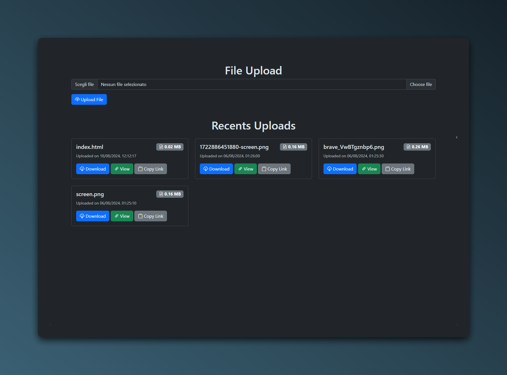

# cdn


A simple and easy to use CDN for static files.



## Table of Contents
- [Introduction](#introduction)
- [Features](#features)
- [Getting Started](#getting-started)
- [Usage](#usage)
- [Contributing](#contributing)

## Introduction

A Web CDN for static files. It is a simple and easy to use CDN for static files. It is built using Node.js and Express.js. It uses a Discord with passport.js for authentication and a local JSON database for storing data. 


## Features

- **Authentication**: Users can sign up and login using Discord.
- **Upload Files**: Users can upload files to the CDN.
- **Delete Files**: Users can delete files from the CDN.
- **View Files**: Users can view files in the CDN.
- **Download Files**: Users can download files from the CDN.
- **File Management**: Users can manage their files in the CDN.
- **Display**: It displays the files in a grid view, showing the file name, file size, and upload date.


## Getting Started

To install the project, you need to have [Node.js](https://nodejs.org/) installed on your machine.

1. Clone the repository:

    ```bash
    git clone https://github.com/EXELVI/cdn.git
    ```
    
2. Change the directory:

    ```bash
    cd cdn
    ```

3. Install the dependencies:

    ```bash
    npm install
    ```

4. Create a `.env` file in the root directory and add the following environment variables:

    ```env
    CLIENT_ID="YOUR_DISCORD_APP_CLIENT_ID"
    CLIENT_SECRET="YOUR_DISCORD_APP_CLIENT_SECRET"
    ```

5. Create a `db.json` file in the root directory and add the following JSON data:

    ```json
    {
   
    }
    ```

6. Start the server:

    ```bash
    npm start
    ```

7. Open your browser and go to `http://localhost:3000` to view the application.


## Contributing

Contributions are welcome! If you have any ideas or suggestions, please open an issue or submit a pull request.
